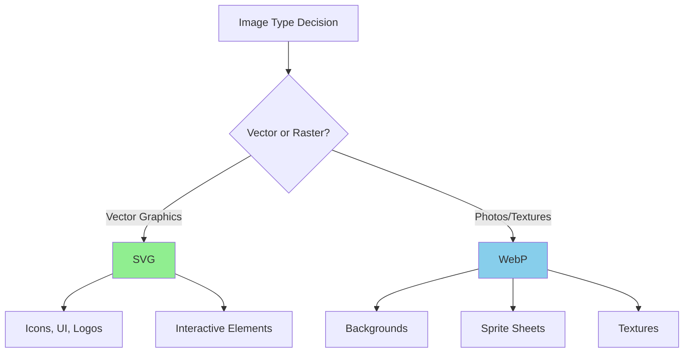
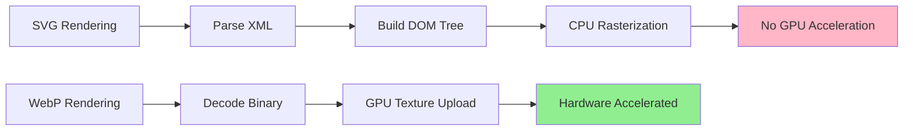
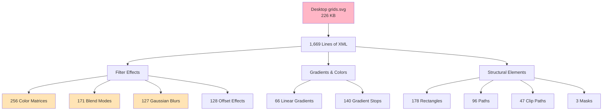
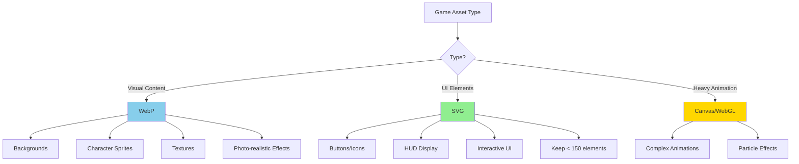

# WebP vs SVG: Image Format Comparison for Web Games

## Quick Comparison

## Performance Characteristics

| Aspect | WebP | SVG |
|--------|------|-----|
| File Size | 25-34% smaller than JPEG/PNG | Smaller for simple vectors |
| Scalability | Fixed resolution | Infinite scaling |
| Rendering | Hardware-accelerated | **CPU-bound, not GPU-accelerated** |
| Browser Support (2025) | Universal | Universal (with limitations) |
| Animation | Smooth, frame-based | Interactive, CSS/JS-based |

## WebP Advantages

- **Optimized decoding**: Low-level browser routines
- **Smaller files**: Excellent compression for photos
- **Best for**: Gradients, textures, photorealistic imagery
- **Animation**: Animated WebP for high-quality sequences

## SVG Advantages

- **Infinite scaling**: No quality loss at any size
- **Interactivity**: CSS styling + JavaScript manipulation
- **Small footprint**: For simple vector graphics
- **Best for**: Icons, logos, UI elements

## SVG Performance Issues

### Critical Limitations

1. **No hardware-accelerated compositing** (available in HTML/CSS for 10+ years)
2. **Transform operations** not GPU-accelerated in all browsers
3. **Large/complex SVGs** are rendering bottlenecks
4. **Safari-specific issues**:
   - No SMIL animation support
   - Limited filter/mask-type/paint-order support
   - Potential pixelation of icons

### React/TSX Performance Issues

- Large SVG → TSX conversion increases JavaScript burden
- Heavy JSX processing on each render
- **Solution**: Use external SVG files, not inline JSX

## Real-World Case Study: When SVG Becomes Bloated

### File Size Comparison

A practical comparison between two versions of the same grid design:

| File | Size | Format | Size Difference |
|------|------|--------|-----------------|
| `grid.webp` | **90 KB** | Raster (WebP) | Baseline |
| `Desktop grids.svg` | **226 KB** | Vector (SVG) | **+151% larger** |

**Result: WebP is 60% smaller (136 KB savings)**

### SVG Complexity Analysis

Analysis of `Desktop grids.svg` reveals extreme complexity:

**Complexity Breakdown:**

| Category | Count | Impact |
|----------|-------|--------|
| Total Lines | 1,669 | Large XML parsing overhead |
| Filter Effects | 256 color matrices + 171 blends | Heavy CPU processing |
| Gradients | 66 linear gradients + 140 stops | Complex rendering calculations |
| Clipping/Masking | 47 clip paths + 3 masks | Additional rendering passes |
| Total Elements | ~500 SVG elements | Deep DOM tree |

### Why SVG Became Larger: Web Research Evidence

#### 1. Complex Graphics Cause SVG Bloat
> "SVG may not be ideal for high-resolution photos or complex designs since it requires complex paths and nodes, which can **inflate file size and reduce performance**."
>
> "There are situations where a complicated SVG contains so many shapes, colors, gradients and masks that it actually **starts to outweigh a JPG or PNG in file size**."
>
> *Source: Web performance studies (2025)*

#### 2. WebP Outperforms for Complex Imagery
> "**WebP outperforms any vector approach when color gradients and textures dominate** complex imagery with photo realism."
>
> "WebP offers **up to 30% smaller file size** with the same quality compared to PNG & JPG."
>
> *Source: Image format comparison studies (2025)*

#### 3. SVG Parsing Overhead
> "Because SVG is XML text, **parsing adds CPU work on page load especially for large or complex SVGs**."
>
> *Source: Browser performance research (2025)*

### Performance Impact Comparison

| Metric | grid.webp (90 KB) | Desktop grids.svg (226 KB) |
|--------|-------------------|----------------------------|
| **Download Time** | Baseline | 2.5x slower |
| **Parsing Time** | Instant binary decode | Parse 1,669 lines of XML |
| **Rendering Method** | GPU hardware-accelerated | CPU rasterization (no GPU) |
| **Memory Usage** | Low (single texture) | High (DOM tree + 500 elements) |
| **Browser Optimization** | Optimized decoder routines | Limited SVG optimization |

### When "SVG is Lightweight" Myth Fails

The assumption that "SVG is lightweight and performant" **only applies to**:
- ✅ Simple icons and logos
- ✅ Solid colors or minimal gradients
- ✅ Less than ~100 elements
- ✅ No complex filter effects

**This case study demonstrates SVG bloat when:**
- ❌ 256+ filter effects (blur, blend, offset)
- ❌ 66 complex gradients with 140 color stops
- ❌ Nearly 500 SVG elements
- ❌ 1,669 lines of XML code
- ❌ Multiple masks and clipping paths

**Recommendation**: For complex UI mockups, design previews, or graphics with extensive effects, **use WebP for 60% file size savings and significantly better rendering performance**.

## Figma Effects to Avoid with SVG

When exporting from Figma to SVG, avoid these effects:

### ❌ Not Supported / Limited Support

| Effect | Issue | Alternative |
|--------|-------|-------------|
| **SMIL Animations** | Safari doesn't support | CSS animations / JavaScript |
| **Blur Effects** | Limited Safari support | CSS filter or use WebP |
| **Drop Shadows** | Performance issues | CSS box-shadow or WebP |
| **Mask-type: alpha** | Unstable in Safari | Simple clip-path or raster |
| **paint-order** | Safari compatibility | Default order or split layers |
| **Blend Modes** | Performance overhead | Use WebP for complex blending |

### ✅ Safe Figma Settings for SVG Export

- Simple shapes and paths
- Solid fills (gradients acceptable but minimize)
- Minimal nodes and simple paths
- Avoid complex Boolean operations

## Usage Recommendations for Web Games

### Use WebP For:
- Game backgrounds and scenes
- Character sprite sheets
- Textures and materials
- Photo-realistic visual effects
- Frame-based animations

### Use SVG For:
- UI interface elements (buttons, icons)
- HUD displays (score, health bars)
- CSS/JS interactive elements
- Simple vector graphics
- **Limit: ~150 visible elements per frame**

### Use Canvas/WebGL For:
- Complex animations with many objects
- Particle systems
- Heavy computational graphics

## Optimization Best Practices

1. **SVG Optimization**:
   - Use external files, not inline TSX
   - Optimize with SVGO
   - Implement viewport culling (hide off-screen elements)
   - Keep SVG complexity low

2. **WebP Optimization**:
   - Compress appropriately for quality vs size
   - Use responsive images (different sizes for different viewports)
   - Lazy load non-critical images

3. **Cross-browser Testing**:
   - Test especially on Safari for SVG compatibility
   - Verify animation performance across browsers

## Conclusion

**For web games**: Use **WebP** for primary visual assets, **SVG** for UI/interactive elements, and consider **Canvas/WebGL** for heavy animations.

---

*References: Research files in `/research/` directory and web performance studies (2025)*
